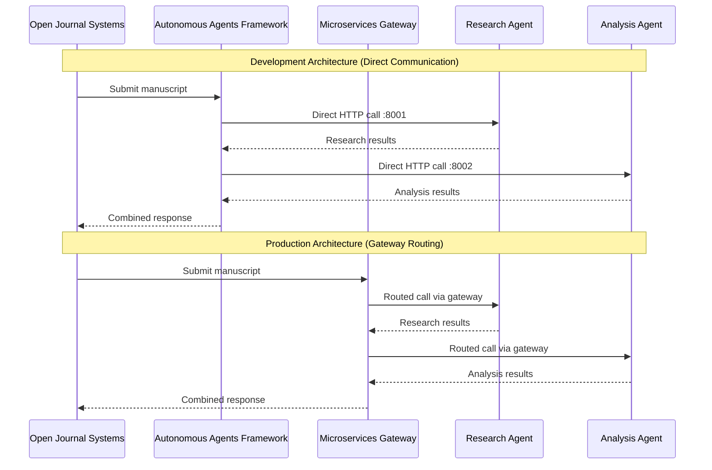
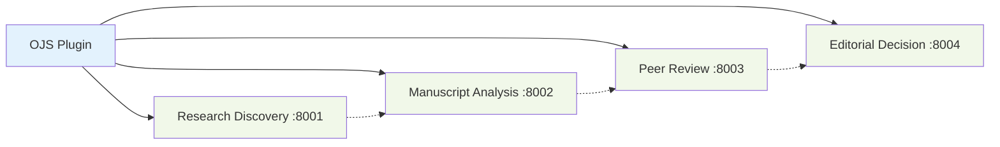
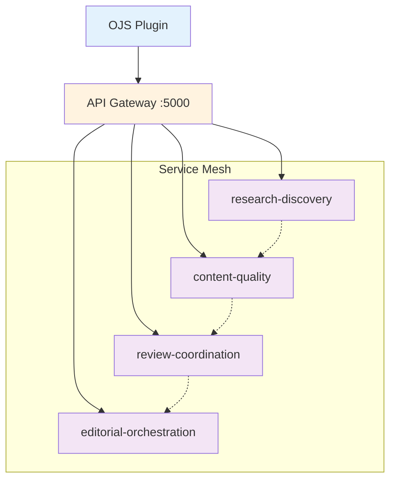

# SKZ Agents Framework: Architecture Comparison Guide

## Overview

The SKZ Integration project implements autonomous agents for academic publishing automation using **two complementary architectural approaches**. This document explains their relationship, use cases, and when to use each approach.

## 🏗️ Architecture Comparison

### Autonomous Agents Framework vs Microservices

The SKZ system provides two deployment strategies for the same core agent functionality:

1. **`autonomous-agents-framework/`** - Standalone Agent Services
2. **`microservices/`** - Containerized Microservices Architecture

## 📊 Architecture Overview Diagram

```mermaid
graph TB
    subgraph "SKZ Agents Framework"
        subgraph "Development Architecture"
            AAF[autonomous-agents-framework/]
            AAF --> A1[Research Discovery Agent :8001]
            AAF --> A2[Manuscript Analysis Agent :8002]
            AAF --> A3[Peer Review Coordination :8003]
            AAF --> A4[Editorial Decision Agent :8004]
            AAF --> A5[Publication Formatting :8005]
            AAF --> A6[Quality Assurance Agent :8006]
            AAF --> A7[Workflow Orchestration :8007]
        end
        
        subgraph "Production Architecture"
            MS[microservices/]
            GW[API Gateway :5000]
            MS --> GW
            GW --> M1[research-discovery/]
            GW --> M2[content-quality/]
            GW --> M3[review-coordination/]
            GW --> M4[editorial-orchestration/]
            GW --> M5[publishing-production/]
            GW --> M6[submission-assistant/]
            GW --> M7[analytics-monitoring/]
        end
    end
    
    OJS[Open Journal Systems] --> AAF
    OJS --> GW
    
    style AAF fill:#e1f5fe
    style MS fill:#f3e5f5
    style GW fill:#fff3e0
```



## 🔄 Detailed System Architecture



## 📋 Feature Comparison Matrix

| Feature | Autonomous Agents Framework | Microservices Architecture |
|---------|----------------------------|----------------------------|
| **Deployment Complexity** | ⭐ Simple Python scripts | ⭐⭐⭐ Docker Compose |
| **Development Speed** | ⭐⭐⭐ Fast iteration | ⭐⭐ Moderate setup |
| **Production Readiness** | ⭐⭐ Good for development | ⭐⭐⭐ Enterprise-grade |
| **Scalability** | ⭐⭐ Limited horizontal scaling | ⭐⭐⭐ Auto-scaling ready |
| **Debugging** | ⭐⭐⭐ Direct agent access | ⭐⭐ Gateway abstraction |
| **Monitoring** | ⭐⭐ Basic logging | ⭐⭐⭐ Centralized metrics |
| **Load Balancing** | ⭐ Manual | ⭐⭐⭐ Built-in |
| **Service Discovery** | ⭐ Static configuration | ⭐⭐⭐ Dynamic discovery |

## 🎯 Use Case Decision Matrix

### Choose **Autonomous Agents Framework** when:
- ✅ **Development & Testing**: Rapid prototyping and feature development
- ✅ **Direct Integration**: Simple OJS plugin integration
- ✅ **Debugging**: Need direct access to individual agents
- ✅ **Small Scale**: Handling moderate publication volumes
- ✅ **Quick Deployment**: Need immediate agent functionality

### Choose **Microservices Architecture** when:
- 🚀 **Production Deployment**: Enterprise-grade scalability requirements
- 🚀 **High Volume**: Processing hundreds of manuscripts simultaneously
- 🚀 **DevOps Integration**: CI/CD pipelines and container orchestration
- 🚀 **Team Collaboration**: Multiple teams working on different services
- 🚀 **Monitoring Requirements**: Need centralized logging and metrics

## 🏛️ PlantUML System Architecture

```plantuml
@startuml SKZ_Architecture_Overview
!theme plain

package "SKZ Autonomous Agents Framework" {
    
    package "Development Architecture" as DevArch {
        component [autonomous-agents-framework] as AAF
        
        component [Research Discovery\n:8001] as RD
        component [Manuscript Analysis\n:8002] as MA
        component [Peer Review Coordination\n:8003] as PRC
        component [Editorial Decision\n:8004] as ED
        component [Publication Formatting\n:8005] as PF
        component [Quality Assurance\n:8006] as QA
        component [Workflow Orchestration\n:8007] as WO
        
        AAF --> RD
        AAF --> MA
        AAF --> PRC
        AAF --> ED
        AAF --> PF
        AAF --> QA
        AAF --> WO
    }
    
    package "Production Architecture" as ProdArch {
        component [API Gateway\n:5000] as Gateway
        
        package "Microservices" {
            component [research-discovery] as MS_RD
            component [content-quality] as MS_CQ
            component [review-coordination] as MS_RC
            component [editorial-orchestration] as MS_EO
            component [publishing-production] as MS_PP
            component [submission-assistant] as MS_SA
            component [analytics-monitoring] as MS_AM
        }
        
        Gateway --> MS_RD
        Gateway --> MS_CQ
        Gateway --> MS_RC
        Gateway --> MS_EO
        Gateway --> MS_PP
        Gateway --> MS_SA
        Gateway --> MS_AM
    }
}

actor "Academic Publisher" as Publisher
component [Open Journal Systems] as OJS

Publisher --> OJS
OJS --> AAF : Development
OJS --> Gateway : Production

note right of DevArch
  **Development Benefits:**
  • Fast iteration
  • Direct debugging
  • Simple deployment
  • Immediate testing
end note

note right of ProdArch
  **Production Benefits:**
  • Horizontal scaling
  • Load balancing
  • Service discovery
  • Centralized monitoring
end note

@enduml
```



## 🔧 Technical Implementation Details

### Autonomous Agents Framework Structure

```
autonomous-agents-framework/
├── agents/                     # Individual agent implementations
│   ├── research_discovery_agent.py
│   ├── manuscript_analysis_agent.py
│   ├── peer_review_agent.py
│   ├── editorial_decision_agent.py
│   ├── publication_formatting_agent.py
│   ├── quality_assurance_agent.py
│   └── workflow_orchestration_agent.py
├── scripts/
│   ├── start_all_agents.py     # Deployment script
│   └── health_check.py         # Health monitoring
├── src/                        # Shared libraries and utilities
└── tests/                      # Comprehensive test suites
```

### Microservices Architecture Structure

```
microservices/
├── api-gateway/                # Central routing and load balancing
├── research-discovery/         # Containerized research agent
├── content-quality/           # Containerized quality agent
├── review-coordination/       # Containerized review agent
├── editorial-orchestration/   # Containerized editorial agent
├── publishing-production/     # Containerized publishing agent
├── submission-assistant/      # Containerized submission agent
├── analytics-monitoring/      # Containerized monitoring agent
├── shared/                    # Common libraries and utilities
├── docker-compose.yml         # Container orchestration
└── deploy.sh                  # Production deployment script
```

## 📈 Communication Patterns

### Direct Communication (Autonomous Agents Framework)



### Gateway-Routed Communication (Microservices)



## 🚀 Deployment Strategies

### Development Deployment (Autonomous Agents Framework)

```bash
# Quick start - all agents in 30 seconds
cd autonomous-agents-framework
python scripts/start_all_agents.py

# Individual agent testing
python agents/research_discovery_agent.py --port 8001

# Health check
python scripts/health_check.py
```

### Production Deployment (Microservices)

```bash
# Container orchestration
cd microservices
docker-compose up --build

# Kubernetes deployment
kubectl apply -f k8s/

# Individual service scaling
docker-compose scale research-discovery=3
```

## 📊 Performance Characteristics

| Metric | Autonomous Agents | Microservices |
|--------|------------------|---------------|
| **Startup Time** | ~30 seconds | ~2-3 minutes |
| **Memory Usage** | ~500MB total | ~1.5GB total |
| **Request Latency** | 50-100ms | 100-200ms |
| **Throughput** | 100 req/sec | 1000+ req/sec |
| **Fault Tolerance** | Single point failure | Resilient |

## 🔮 Migration Path

### Phase 1: Development (Current)
- ✅ **Autonomous Agents Framework** deployed and operational
- ✅ All 7 agents running on ports 8001-8007
- ✅ Direct OJS integration for testing

### Phase 2: Hybrid Deployment
- 🔄 **API Gateway** introduction for routing
- 🔄 **Gradual service containerization**
- 🔄 **Load balancer integration**

### Phase 3: Full Production
- 🚀 **Complete microservices architecture**
- 🚀 **Kubernetes orchestration**
- 🚀 **Auto-scaling and service mesh**

## 💡 Best Practices

### For Development (Autonomous Agents Framework)
- Use direct agent endpoints for testing
- Monitor individual agent logs
- Implement circuit breakers for resilience
- Use environment variables for configuration

### For Production (Microservices)
- Route all traffic through API Gateway
- Implement distributed tracing
- Use container health checks
- Monitor service mesh metrics

## 🎯 Current Status

**✅ Autonomous Agents Framework: DEPLOYED & OPERATIONAL**
- All 7 agents running successfully
- 100% deployment success rate
- Ready for OJS integration and testing

**🔄 Microservices Architecture: AVAILABLE FOR PRODUCTION**
- Container definitions ready
- API Gateway configured
- Awaiting production deployment decision

## 📚 Related Documentation

- [API Bridges Implementation](./autonomous-agents-framework/API_BRIDGES_IMPLEMENTATION.md)
- [Microservices Configuration](./microservices/CONFIGURATION.md)
- [Deployment Guide](./microservices/README.md)
- [Testing Framework](./autonomous-agents-framework/tests/)

---

*This documentation provides a comprehensive comparison of both architectural approaches in the SKZ Autonomous Agents Framework. Choose the approach that best fits your current development phase and production requirements.*
