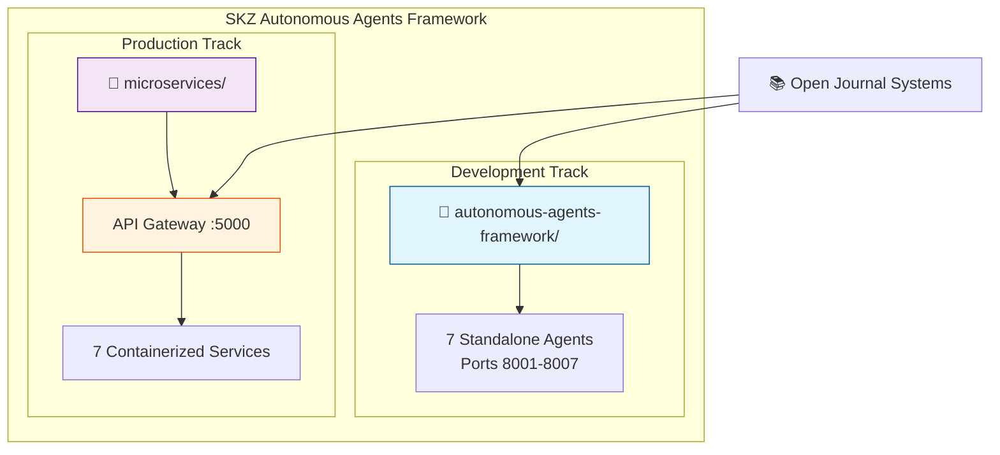
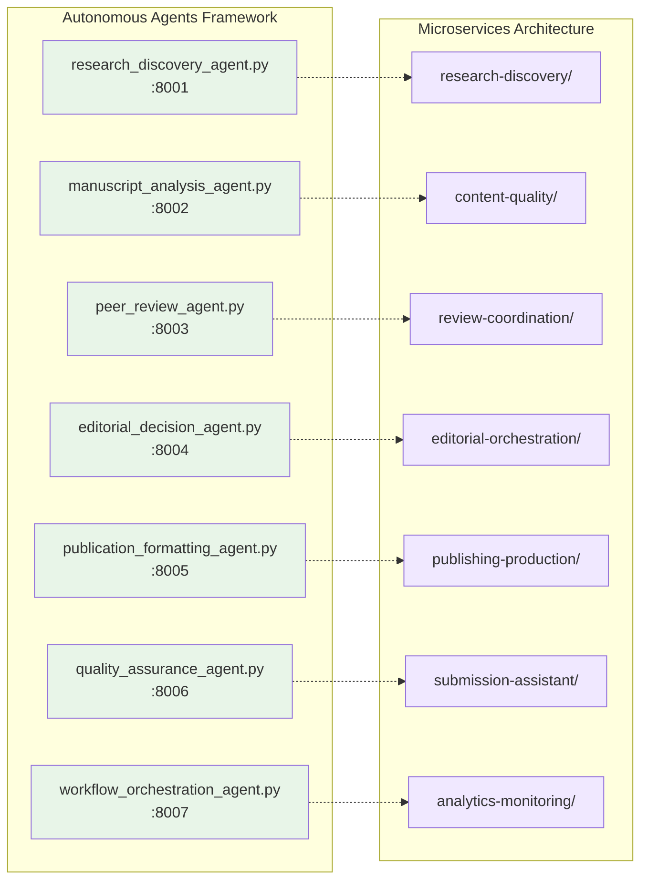
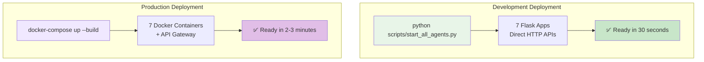
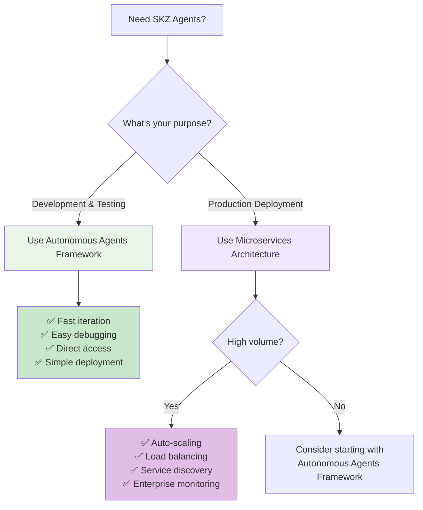
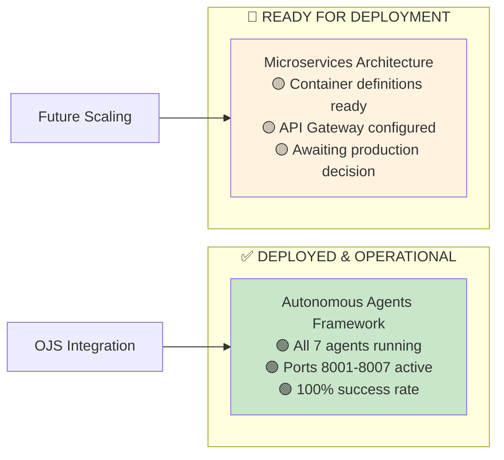

# SKZ Architecture Quick Reference Diagrams

## 🏗️ High-Level Architecture Overview



## 🔄 Agent Mapping Between Architectures



## 📊 Deployment Comparison



## 🎯 Use Case Decision Tree



## 🔧 Current Status Dashboard



## 📈 Evolution Path

```mermaid
timeline
    title SKZ Architecture Evolution
    
    section Phase 1 : Development
        Current Status : Autonomous Agents Framework
                      : 7 agents deployed
                      : Direct HTTP APIs
                      : Development & testing ready
    
    section Phase 2 : Hybrid
        API Gateway    : Introduce central routing
                      : Gradual containerization
                      : Load balancer integration
    
    section Phase 3 : Production
        Microservices  : Full container orchestration
                      : Kubernetes deployment
                      : Auto-scaling & service mesh
```
